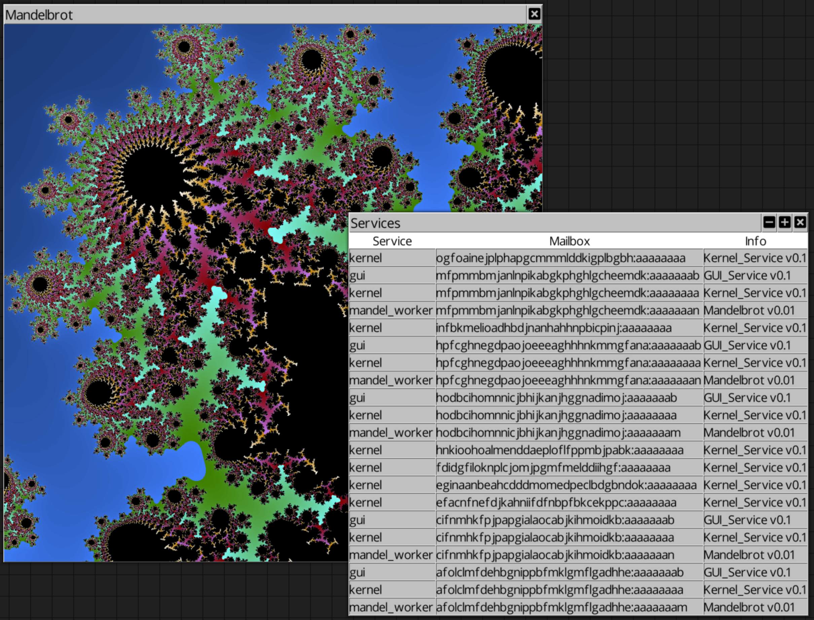

# ChrysaLib

ChrysaLisp and ChrysaLib now work together, using the same communication
protocols. As a result the ChrysaLisp `usb-links` branch has been deleted as it
is now redundant.

ChrysaLib now provides IP, USB and SHMEM link connectivity, you can setup a
backbone network with ChrysaLib's `hub_node` and launch ChrysaLisp subnets that
come and go freely.

ChrysaLisp subnets can share work and services with themselves plus ChrysaLib
services provided in C++ can also be seen and used.
